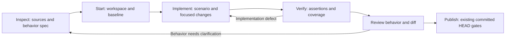

# Improving portable-jira-flow with spec-driven development

Assessment date: 2026-09-08. Status: design proposal; runtime behavior is unchanged.

The most valuable improvement is a small, durable behavioral specification that connects Jira intent to implementation and verification. Preserve the existing command model and safety controls. Add stable requirement and scenario references, make changes to the specification invalidate dependent results, and reduce repeated document generation around that core.

The current flow already provides useful planning and acceptance mapping. Its strongest area is operational control: workspace ownership, explicit side-effect boundaries, evidence, and committed-HEAD publishing. Its main weakness is that these controls do not yet establish a persistent, machine-checkable contract for the behavior being delivered.

## Scope and evidence

This review assesses the canonical shared repository, including its existing uncommitted additions, at base commit `a2b7f2b`. It covers the shared skill, command/artifact/configuration contracts, templates, publishing, evidence and performance handling, Python helpers, adapters, and manual evals. It does not assess private profile overlays, real Jira tickets, or application behavior. No private config was needed.

The primary reference is the [supplied book](../books/README.md), particularly chapters 2–6 and 9–10. Findings below distinguish observed repository behavior from recommended adaptations. The [evidence record](spec-driven-development-evidence.json) contains the full base revision, fingerprints of the pre-existing public files, and isolated probe results. Existing files were preserved.

Two supplementary primary sources were checked on the assessment date. The author's [AI Unified Process site](https://unifiedprocess.ai/) also presents maintained behavioral specifications as the center of an iterative workflow. GitHub's [Spec Kit command reference](https://github.com/github/spec-kit#available-slash-commands) separates requirements, technical planning, tasks, clarification, and cross-artifact analysis. These support the proposed separation of concerns; they do not establish that replacing this skill with either tool would improve delivery.

## Preserve these strengths

| Current strength | Repository evidence | Relationship to the book |
|---|---|---|
| Inspect and plan before code changes | [commands.md](../../references/commands.md), lines 46–87 | Already supports specifying before implementation; book pp. 23–24, PDF 42–43. |
| One operational state with derived summaries | [artifacts.md](../../references/artifacts.md), lines 35–137 | Provides a foundation for reproducible status and traceability. It should retain authority over run state. |
| Isolated workspaces and explicit mutation/publish boundaries | [safety.md](../../references/safety.md); [publishing.md](../../references/publishing.md) | Supports controlled changes and reviewability; book pp. 75–81, PDF 92–98. |
| Existing acceptance-to-E2E mapping | [configuration.md](../../references/configuration.md), lines 283–312; [templates.md](../../references/templates.md), lines 364–405 | A starting point for scenario-level coverage; book pp. 86–97, PDF 103–114. |
| Before/after evidence and performance measurements | [evidence.md](../../references/evidence.md); [performance.md](../../references/performance.md) | Useful validation evidence and a foundation for measurable quality requirements. |
| Shared core, thin assistant adapters, local stack profiles | [SKILL.md](../../SKILL.md); [install.py](../../scripts/install.py) | Matches portable process knowledge with stack-specific execution; book pp. 72–75 and 108, PDF 89–92 and 125. |

## Prioritized findings

Priorities describe implementation order, not incident severity. P0 establishes trustworthy contracts, P1 adds behavioral traceability, and P2 optimizes an established flow.

### F1 — P1: A plan exists, but a durable behavior specification does not

**Observed:** The implementation plan contains acceptance criteria, likely files, impact, validation, risk, and open questions. It has no required representation of actor, trigger, success flow, alternatives, failure guarantees, or stable business-rule IDs. The artifact registry has 44 entries, all non-committable by default; none defines a durable product specification. See [templates.md](../../references/templates.md), lines 264–334, and [artifacts.md](../../references/artifacts.md), lines 139–187. Registry size describes available artifact types, not documents necessarily created for every ticket.

**Why it matters:** A technically plausible plan can leave a business decision implicit. Later tickets can reinterpret the same behavior because previous intent lives in local run artifacts rather than a maintained product contract.

**Recommendation:** Add a concise specification containing linked functional requirements, applicable quality requirements and constraints, domain terms, and observable scenarios. Use stable identifiers such as `TASKS-FR-001`, `TASKS-UC-001`, and `TASKS-UC-001-A1`. Keep Jira keys as change-request links. Reuse an existing domain/use-case ID when another ticket changes the same behavior; never recycle a retired ID. Record a tombstone or replacement link for retired requirements.

Start with one file for one behavioral change. Link to existing domain definitions rather than rebuilding an entity model for every bug. Split into a context-owned catalog, entity model, and use cases when reuse makes that useful. This is an incremental adaptation of the book's three-part specification core, not a requirement to produce three new documents per ticket. [Book pp. 14–24, PDF 33–43](../books/spec-driven-development.pdf#page=33); [pp. 49–60, PDF 66–77](../books/spec-driven-development.pdf#page=66).

### F2 — P1: Coverage links are primarily narrative and appear late

**Observed:** `verify` derives E2E scenarios from `manual-validation-steps.md`; the table links browser steps to acceptance criteria. `implementation.filesChanged` records repository, path, and change note. The public run contract does not require links from requirements to scenarios, plan tasks, changed files, assertions, and results. See [commands.md](../../references/commands.md), lines 74–108, and [artifacts.md](../../references/artifacts.md), lines 39–137.

**Recommendation:** Plan scenario coverage during `inspect`, before implementation. Extend structured state with requirement IDs, use-case/scenario IDs, task dependencies, relevant source/test references, and observed results. Generate manual steps, E2E inputs, acceptance coverage, and final summaries from those links. A specification's expected result must remain independent of an implementation's actual result.

Distinguish `planned`, `implemented`, `passed`, `failed`, `blocked`, `skipped`, and `not_applicable` where appropriate. An existing test file is not proof that a scenario passed. A screenshot proves only the assertion it actually supports. Unknown coverage remains unknown. [Book pp. 59–60, PDF 76–77](../books/spec-driven-development.pdf#page=76); [pp. 86–97, PDF 103–114](../books/spec-driven-development.pdf#page=103).

### F3 — P1: Readiness checks clarity, but not the provenance of decisions

**Observed:** Readiness asks whether behavior and acceptance criteria are clear; `implement` requires explicit intent and an acceptable current plan. The templates do not distinguish an established requirement from an agent's inferred business rule, or bind reviewed intent to a specification revision. See [templates.md](../../references/templates.md), lines 264–334, and [commands.md](../../references/commands.md), lines 74–87.

**Recommendation:** Record each material assumption's source, affected scenarios, and resolution. Preserve review evidence when the user or existing reviewed requirement already establishes the behavior. Ask only when a missing decision would change the business outcome, scope, or an action requiring authorization. Continue independent work while that decision is pending. Do not label an agent-authored draft as human-approved or request approval again for unchanged, already-authorized work.

Readiness should answer concrete questions: can the expected outcome be asserted, is an applicable failure state specified, are sources contradictory, and would implementation require inventing a rule? A vocabulary linter can flag ambiguity, but cannot determine business correctness. The book emphasizes human review; the recommended implementation respects that without introducing a confirmation at every command. [Book p. 32, PDF 50](../books/spec-driven-development.pdf#page=50); [pp. 48–53, PDF 65–70](../books/spec-driven-development.pdf#page=65); [p. 148, PDF 163](../books/spec-driven-development.pdf#page=163).

### F4 — P1: Freshness covers execution changes but not specification revisions

**Observed:** Freshness already considers HEAD, workspace, profile, stage changes, and evidence age. It does not define a behavior-specification digest, requirement revision, or dependency graph for invalidation. A generic `run.json.updatedAt` comparison can also stale an unrelated derived view after an incidental state update. See [artifacts.md](../../references/artifacts.md), lines 231–246.

**Recommendation:** Record explicit inputs to every relevant result: selected specification content digest, source requirement revision, implementation/test tree or committed SHA, command definition, dependency/toolchain version, and applicable environment/data identity. Use a set of repository revisions for work spanning repositories. Start with conservative invalidation when any relevant source changes; optimize only after dependency mapping is reliable.

On a behavior change, compare the specification revisions first, identify affected scenarios, update the plan, then synchronize code and tests in small diffs. Do not rewrite the entire feature. A child defect sharing a parent branch still needs its own scenario attribution, and a changed shared HEAD invalidates older execution evidence even when another ticket made the change. [Book pp. 76–83, PDF 93–100](../books/spec-driven-development.pdf#page=93).

### F5 — P0: Executable helpers and documentation disagree, and validation misses invalid contracts

**Observed and reproduced using temporary public fixtures:**

| Probe | Actual result | Implication |
|---|---|---|
| Run the current package validator on the public fixture | Exit 0 | Existing checks pass for the assessed working tree. |
| Set `stageRegistry.implementation.readOnly` to the string `"false"` | Validator still exits 0 | It does not enforce this boolean type, although the schema declares it. |
| Append `nonexistentStage` to `invocation.primaryCommands.verify` | Validator still exits 0 | Command-to-stage references are not checked. |
| Give `evidence.load_config()` a directory containing only an example config | It loads the example's default/profile | Runtime behavior contradicts the documented example-only role. |

The relevant implementation is [validate.py](../../scripts/validate.py), lines 175–277 and 302–325, and [evidence.py](../../scripts/evidence.py), lines 58–76. The latter loads `config.example.json` first; the documented [load order](../../references/configuration.md), lines 5–27, begins with `config.json` and says the examples are documentation. The installed adapter supplied with this request also calls examples templates only. The probes do not demonstrate an unauthorized environment action; they demonstrate missing validation and inconsistent configuration semantics.

**Recommendation:** Establish one config loader and contract used by helpers and `doctor`. Keep executable generic defaults in an explicitly named, tracked defaults file if defaults are necessary; do not silently execute example profiles. Define array replacement and overlay precedence once. Separate partial-overlay validation from validation of the final merged config, so the documented minimal config has clear semantics.

Apply actual schema validation plus semantic checks for command/stage/artifact references, valid state transitions, and action boundaries. Add a versioned run-state schema; the current schema validates config structure, while `run.json` is described in prose and examples. Keep old runs readable and mark absent new evidence `unknown`; do not fabricate successful migration results.

The existing [manual evals](../../evals/manual-cases.md) are useful specifications. Turn the high-value boundaries into runnable, credential-free fixtures, including the two invalid-config probes above. This applies the book's executable-contract approach to the skill itself. [Book pp. 86–97, PDF 103–114](../books/spec-driven-development.pdf#page=103).

### F6 — P2: Artifact and context overhead can be reduced without removing evidence

**Observed:** The registry defines 44 artifact types, and `references/templates.md` is 742 lines. Similar MR templates exist both inline and in separate template files. Multiple views repeat acceptance, relationship, evidence, and status data. Conditional routing already exists, so the task is to improve its precision rather than introduce routing from scratch. See [SKILL.md](../../SKILL.md), [templates.md](../../references/templates.md), and [references/templates/](../../references/templates/).

**Recommendation:** Maintain structured state and the behavioral spec as primary inputs. Render derived reports only when a stage consumes them or the user asks for them. Preserve existing paths for compatibility and audit. Load the selected template and relevant use cases instead of the full template catalog. Move duplicated templates to one canonical file and use the catalog as an index.

Retain before/after media policies, but distinguish media capture from test success. Favor appropriately scoped existing unit, service/integration, and browser checks according to the behavior; the book's browserless Vaadin strategy is stack-specific. Do not add browser tests to simple non-UI changes solely to fill a media slot, and do not weaken existing configured evidence requirements during optimization. [Book p. 14, PDF 33](../books/spec-driven-development.pdf#page=33); [p. 72, PDF 89](../books/spec-driven-development.pdf#page=89); [pp. 88–95, PDF 105–112](../books/spec-driven-development.pdf#page=105).

### F7 — P1: Non-functional requirements need acceptance meaning, not only measurements

**Observed:** Performance handling already captures a hypothesis, baseline, comparison, and thresholds. Missing tools or a measurable target warn by default. See [performance.md](../../references/performance.md), lines 21–44 and 92–136. This is a practical default for exploratory optimization, but it does not establish whether a ticket's explicit performance requirement was met.

**Recommendation:** Link measurements to an identified NFR with metric, unit, threshold, percentile if relevant, workload, and measurement conditions. Preserve `not_configured` for missing instrumentation, while reporting that NFR as unverified. Keep measurement improvement separate from satisfying the target: faster can still be too slow. Add ticket/profile-selectable coverage gates when a requirement is mandatory; missing optional media and unmet required behavior must remain separate decisions. Never invent thresholds or claim success from incomparable samples. Apply the same traceability to applicable security, compatibility, and data-integrity constraints. [Book pp. 17 and 34, PDF 36 and 52](../books/spec-driven-development.pdf#page=36); [p. 51, PDF 68](../books/spec-driven-development.pdf#page=68).

## Proposed flow using the existing commands



This is a responsibility map, not new command syntax or permission. `ready`, `accept`, `status`, and `report` remain available with their existing boundaries. Review can happen within the current conversation and normal MR review; a new `review` command is not necessary.

| Command | Proposed addition | Completion evidence |
|---|---|---|
| `inspect` | Draft/update a local behavior spec; resolve source conflicts; map scenarios to planned checks; create dependent implementation tasks | Requirement/source links, bounded outcomes, explicit unresolved decisions, validation mapping |
| `start` | Pin the selected spec revision and workspace/base identity before capturing baselines | Reusable workspace and relevant before-state recorded |
| `implement` | Read the spec, applicable project rules, domain terms, and current code/tests; complete focused tasks; update the spec when intent changes | Each meaningful change has a scenario, rule, or technical-constraint rationale |
| `verify` | Check required scenarios and assertions; refresh coverage and relevant evidence | Actual results bound to the tested inputs; failures and unknowns remain visible |
| `ready` / `accept` | Reuse scenario IDs and target-specific expected results | Readiness never claims exercised acceptance; mutation limits remain intact |
| `publish` | Include spec/code/test consistency and current coverage in existing committed-HEAD validation | Required behavior and policy gates pass on the intended committed changes |
| `status` / `report` | Derive coverage, drift, and the next action from state and referenced inputs | No stale success claims or independent narrative verdicts |

Implement the clarification and consistency checks inside existing stages first. Adopt a new public command only if repeated use shows a distinct need. Spec Kit's optional clarification and analysis commands are useful design precedents, not a reason to expand this skill's command surface. [Spec Kit](https://github.com/github/spec-kit#available-slash-commands).

## Resolve the two kinds of authority explicitly

| Information | Authority and storage |
|---|---|
| Requested intent and scope | User request plus identified Jira/design sources; contradictions are recorded and resolved |
| Intended behavior for implementation | Selected, reviewed/established specification revision, subordinate to current user instructions and policy |
| Execution, observed results, permissions, blockers, next action | Local `run.json` |
| Summaries, manual guides, coverage displays | Derived from the specification references and current run state |

Keep `run.json` authoritative for workflow execution. Add a separate product-specification concept with a clear owner and lifetime. A specification does not grant permission to execute a command, mutate an environment, commit, or publish.

Initially, `inspect` can draft `behavior-spec.md` under the existing ignored run root. That improves clarity but does not solve long-term product memory. Durable adoption requires an explicitly configured spec location in the owning application repository or an approved documentation repository. A proposed path is `specs/<domain>/use-cases/<use-case-id>.md`; do not store private product specifications in this portable public skill repository.

Promote or update product specs during authorized implementation, preserving the rule that `inspect` and `start` do not modify application sources. Classify deliberately maintained product specs as source deliverables through a distinct policy, while logs, raw Jira data, recordings, and run state remain non-committable. Do not change the existing artifact defaults globally. Commit/publish permission remains exactly as before.

Record spec path, content digest, source revision, and the provenance of any review/decision in run state. For a shared behavior spanning repositories, choose one owning spec and record explicit interface/dependency links and each tested repository revision. Historical run artifacts remain historical; do not automatically promote old generated prose into approved specifications.

## Example of the smallest useful behavioral contract

This fictional example illustrates format only. It establishes no requirement for a real ticket.

```markdown
# TASKS-UC-001 — Assign an open task

Change request: ABC-123
Status: draft
Requirement: TASKS-FR-001 — A team member can assign an open,
unassigned Task to an active User in the same Team.
Domain terms: Task, User, Team (link to existing domain definitions).
Scope: a single assignment. Bulk assignment is outside this change.

Preconditions: the actor is authenticated; the Task exists.
Trigger: the actor submits a target User for assignment.

M1: The actor submits the assignment.
M2: The system validates actor membership and Task/User eligibility.
M3: The system assigns the Task and confirms the assignee to the actor.

A1, at M2: Target User is inactive.
The system rejects the assignment and explains the reason.
The Task's assignment remains unchanged.

A2, at M2: Actor or target User is outside the Task's Team.
The system rejects the assignment; the assignment remains unchanged.

A3, at M2: Task is closed or already assigned.
The system rejects the assignment; the assignment remains unchanged.

Success: the selected eligible User is the Task's assignee.
Failure: the previous assignment is preserved.

Coverage: M1–M3 success; A1 inactive target; A2 membership;
A3 invalid Task state. Assert returned feedback and final state.
Decision provenance: fictional example; no human approval recorded.
```

The technical plan then identifies files, design choices, and ordered tasks. Those details can evolve without changing the business outcome. Existing tests may satisfy scenarios; add tests only for meaningful gaps. For a bug, an isolated regression test that fails before the fix and passes afterward is strong evidence when practical. Do not write tests that merely repeat the implementation, and do not force test-first UI work or destructive mutation testing into every ticket. [Book pp. 93–95, PDF 110–112](../books/spec-driven-development.pdf#page=110).

## Implementation sequence and acceptance criteria

All entries below are proposed work, not implemented features.

| Step | Changes | Acceptance criteria |
|---|---|---|
| 1. Align executable contracts | Shared config loader; explicit defaults; schema and registry validation; reusable run-state validation. Targets: `scripts/validate.py`, `scripts/evidence.py`, `config.schema.json`, configuration/artifact references, fixture evals | Both invalid-config probes fail with useful errors; example-only config cannot select an executable profile; valid configured overlays still work; unknown run versions are reported safely. |
| 2. Pilot one behavior spec | Add a specification reference and selected template; extend `inspect`, `implement`, and readiness; add source/scenario/task mapping and an opt-in durable storage policy | One generic feature and one bug can be planned without inventing business rules; unchanged existing approval is reused; current command boundaries and legacy aliases remain valid. |
| 3. Bind verification to behavior | Add run-state traceability/fingerprints, source drift handling, scenario coverage rendering, and publish consistency checks | An edited spec, changed test, changed shared HEAD, or relevant config change invalidates dependent evidence; missing required scenario results cannot be reported as passed; optional media retains its configured warning behavior. |
| 4. Reduce repeated work | Canonical template files; command-specific loading; on-demand derived views; policy-controlled result reuse | Existing consumers retain usable artifact paths; views agree with run state; expensive checks are reused only when the complete tested input identity is unchanged and policy permits it. |
| 5. Expand by measured value | Add context-owned reusable specs, broader rule coverage, and quality-requirement mapping for selected domains | A later ticket updates the same use case rather than duplicating it; cross-repository ownership is explicit; review and verification costs stay acceptable. |

For run-state writes, a shared writer should eventually validate state, write a temporary file, and atomically replace the destination; use revision checks or locking if simultaneous writers are supported. The current evidence helper uses direct `write_text` operations ([evidence.py](../../scripts/evidence.py), lines 43–45 and 604–634). This is a preventive reliability improvement; no lost-update or corrupted-run incident was reproduced in this assessment.

Do not begin with a full workflow-engine rewrite. Small deterministic helpers for loading, validating, updating state, checking references, and rendering cover the most error-prone mechanics while retaining assistant judgment for analysis and implementation.

## Optimization measures and pilot decision

Use a small pilot covering a bug, a feature, and a performance change. Compare similar ticket classes and record sample size; these are proposed measurements, not measured savings.

| Measure | How to interpret it |
|---|---|
| Required scenarios verified / required scenarios | Behavioral coverage; report failed, blocked, and unknown separately; zero applicable scenarios is `not_applicable`. |
| Behavior corrections after implementation begins | A reduction suggests earlier clarification is helping; record whether the source request changed. |
| Review rework caused by missing or misunderstood requirements | Measures the problem the book targets more directly than lines of code. |
| Time spent on repeated checks and artifact rendering | Identifies overhead worth optimizing. |
| Reference bytes/tokens loaded, where available | Tests whether focused routing reduces context use. |
| Stale evidence correctly detected; invalid-fixture cases rejected | Checks correctness of the new controls. |
| Total lead time and human review time by ticket class | Prevents apparent automation savings from hiding added review burden. |

Initially rerun required checks whenever the relevant inputs change. Later, reuse only successful results tied to the exact committed SHA or proven identical validated tree, spec digest, tests, command, dependencies, toolchain, and relevant environment/data state. Never use a timestamp alone, reuse failures as passes, or reuse a local result as proof for a different environment. Existing committed-HEAD publishing requirements remain the default until an explicit policy defines equivalent reusable evidence.

Adopt the next step when coverage and invalidation checks work and the pilot shows less rework without unacceptable review overhead. Keep a lighter form for documentation-only changes and disposable experiments. The book itself supports gradual adoption and reduced ceremony where durable behavioral knowledge adds little value. [Book pp. 149–152, PDF 164–167](../books/spec-driven-development.pdf#page=164).

## Practices to adapt selectively

- Keep the current stack and local profile architecture. The book's Java, Vaadin, jOOQ, migration, and testing commands are examples, not dependencies for this flow.
- Preserve Jira and the team's delivery cadence. The author's preference for Kanban and smaller context-owned teams is not evidence that changing organizational structure is needed here.
- Use stable IDs in specifications, test metadata, and relevant change references. Avoid repetitive annotations in every source line.
- Keep behavioral intent ahead of code while allowing implementation and test feedback to refine the spec. Do not document an observed bug as desired behavior simply because existing code does it.
- Keep private runtime artifacts local even when durable, approved product specs become versioned. The book's broad version-control advice should not erase the current privacy boundaries.
- Keep the book and this assessment outside normal runtime reference routing. Runtime instructions should contain only the short adopted contracts; loading the entire book for ticket work would add cost and conflicting examples.

## Verification performed and limits

The original PDF and repository copy match byte-for-byte and by SHA-256. The current package validator passed. An isolated public-package copy also passed the existing public scan. Two deliberately invalid configuration fixtures were accepted by that validator, and the example-only loader probe reproduced F5; those are findings, not passing behavioral tests.

The assessment evidence records the exact probes and source fingerprints. No Jira, browser, application, deployment, or real-ticket acceptance checks were run. Runtime speed and defect-reduction benefits remain hypotheses until the pilot measures them. This change adds the book and assessment documentation only; the flow's scripts, configuration, adapters, and existing working-tree changes are preserved.
